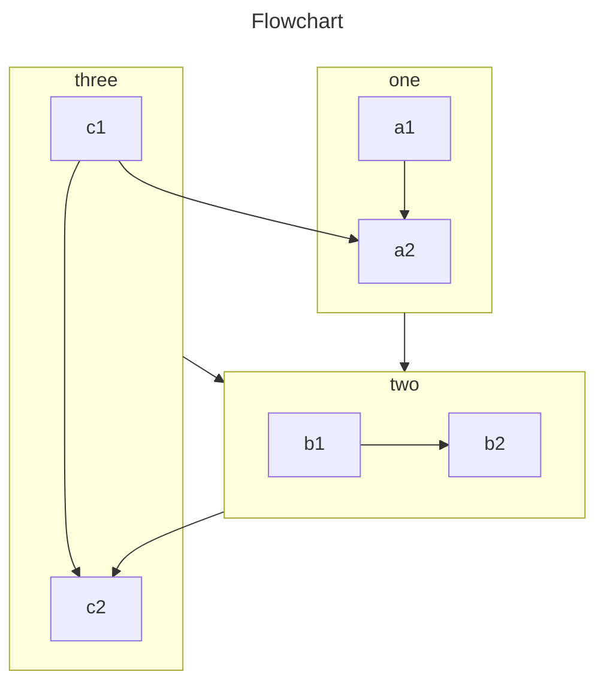

# Phigrim Docs

## 简介

这是一个基于Vuepress的文档项目，由`luch4736`创建，旨在通过社区创造规范。

您可以修改`/src`目录下的`.md`格式的文档，或者在issue中提出您想要加入的功能。

目前，此文档正在缓慢进行推进，包括Phigrim日后可能的支持选项。

## 撰写

### 提交您的编辑

Phigrim Docs在`Github`使用`MPL2.0`协议开源。您可以在[这里](https://github.com/luch4736/Phigrim-Docs-UI/pulls)请求合并您的编辑。

------

### 拓展的Markdown选项：

#### Mermaid

[Mermaid](https://mermaid.js.org/)是一个强大的文档拓展，支持多种表格绘制，Phigrim Docs开启了对此控件的支持，您可以用如下方式加入Mermaid图表：

````markdown

````

效果如下


#### 选项卡

##### 用法

你需要将选项卡包装在 `tabs` 容器中。

你可以在 `tabs` 容器中添加一个 id 后缀，该后缀将用作选项卡 id。 所有具有相同 id 的选项卡将共享相同的切换事件。

```
::: tabs#fruit

<!-- 这里，fruit 将用作 id，它是可选的 -->

<!-- 选项卡内容 -->

:::
```

在这个容器内，你应该使用 `@tab` 标记来标记和分隔选项卡内容。

在 `@tab` 标记后，你可以添加文本 `:active` 默认激活选项卡，之后的文本将被解析为选项卡标题。

```
::: tabs

@tab 标题 1

<!-- tab 1 内容 -->

@tab 标题 2

<!-- tab 2 内容 -->

@tab:active 标题 3

<!-- tab 3 将会被默认激活 -->

<!-- tab 3 内容 -->

:::
```

默认情况下，标题将用作选项卡的值，但你可以使用 id 后缀覆盖它。

```
::: tabs

@tab 标题 1

<!-- 此处，选项卡 1 的标题“标题 1”将用作值。 -->

<!-- tab 1 内容 -->

@tab 标题 2#值 2

<!-- 这里，tab 2 的标题将是 “标题 2”，但它会使用 “值 2” 作为选项卡的值-->

<!-- tab 2 内容 -->

:::
```

