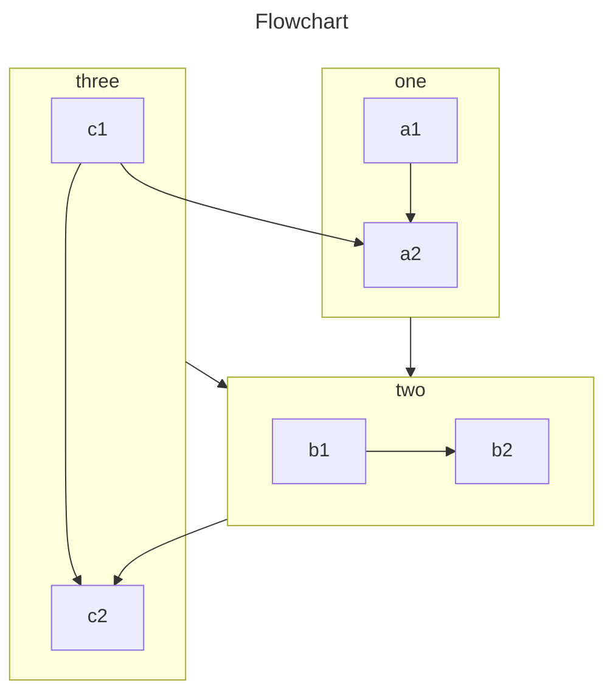

# Phigrim Docs

## 简介

这是一个基于Vuepress的文档项目，旨在通过社区创造规范。

## 撰写

### 提交您的编辑

Phigrim Docs在`Github`使用`MPL2.0`协议开源。您可以在[这里](https://github.com/luch4736/Phigrim-Docs-UI/pulls)请求合并您的编辑

### 拓展的Markdown选项：

#### Mermaid

[Mermaid](https://mermaid.js.org/)是一个强大的文档拓展，支持多种表格绘制，Phigrim Docs开启了对此控件的支持，您可以用如下方式加入Mermaid图表

````markdown

````

效果如下


